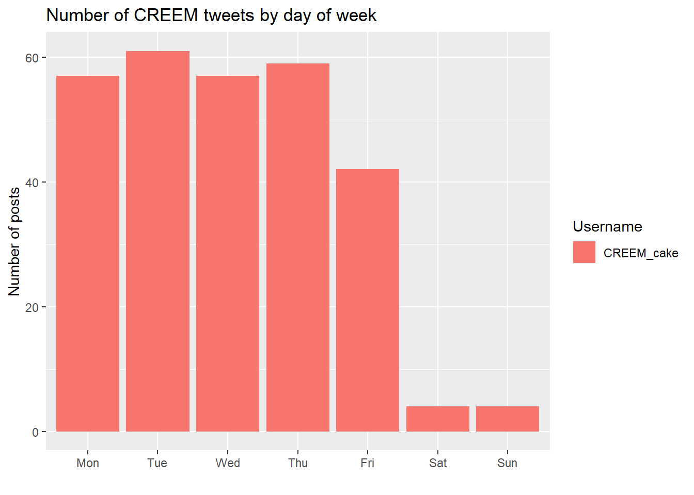

-   
# CREEM Social Media Analysis R code


```r
library(tidyverse)
```

```
## Warning: package 'tidyverse' was built under R version 4.1.3
```

```
## -- Attaching packages --------------------------------------- tidyverse 1.3.1 --
```

```
## v ggplot2 3.3.6     v purrr   0.3.4
## v tibble  3.1.6     v dplyr   1.0.7
## v tidyr   1.1.4     v stringr 1.4.0
## v readr   2.1.1     v forcats 0.5.1
```

```
## Warning: package 'ggplot2' was built under R version 4.1.3
```

```
## -- Conflicts ------------------------------------------ tidyverse_conflicts() --
## x dplyr::filter() masks stats::filter()
## x dplyr::lag()    masks stats::lag()
```

```r
library(dplyr)
library(lubridate)
```

```
## Warning: package 'lubridate' was built under R version 4.1.3
```

```
## 
## Attaching package: 'lubridate'
```

```
## The following objects are masked from 'package:base':
## 
##     date, intersect, setdiff, union
```

### How has our following grown since 2019?

Using data scraped from Twitter Analytics, we can build a time series of
how we have built a community on twitter. Observing the followers
manually, it is likely that the majority is not students of st Andrews
or other universities but mostly researchers and academics following
CREEM research.

This data is only accessible for the CREEM_cake account, hence
incomparable with our peers.


```r
profile_ts <- read.csv('data/creem_data.csv',col.names = c('date','New.followers')) %>% 
  # rename(date = ï..date) %>% 
  mutate(date = as.Date(date)) %>% 
  filter(date > as.Date('2019-01-01'))
                   
# head(profile_ts)
coeff <- 0.5
g <- ggplot(profile_ts, 
            aes(x = date, y = New.followers/coeff)) 

g + geom_col() + 
  labs(title = "Follower Growth in the Last 3 years",
       x="") +
  geom_line(aes(x = date, y = cumsum(New.followers), 
                color = 'CREEM_cake'
                )) +
   scale_y_continuous(
    # Features of the first axis
    name = "Cumalitve Follower growth",
    # Add a second axis and specify its features
    sec.axis = sec_axis(~.*coeff, name="New followers")
  ) +
  theme(legend.title=element_blank())
```


```r
# legend.position=”none”
# plot(x = profile_ts$date,y = profile_ts$New.followers)== 
```
Why was there a spike in followers?
### How often have we been posting in this period?


```r
#loading the data Scraped from SNScrape
tweets <-  read.csv('data/tweet_data.csv') %>% 
                mutate(dt= ymd_hms(Datetime),
                       Tweet.Id = as.character(Tweet.Id),
                       year_month = floor_date(as.Date(Datetime),
                                               unit = "month"),
                       year_week = floor_date(as.Date(Datetime),
                                               unit = "week"),
                       time = format(Datetime, format = "%H:%M:%S"),
                       #round time to nearest qtr
                       time_30 = format(round_date(dt, "30 minutes"),
                                        format = "%H:%M:%S"),
                      
                       #remove open close brackets
                       hashtags = gsub("\\[|\\]|\\'","",hashtags) 
                       )
summary(tweets)
```

```
##        X           Datetime           Tweet.Id           content         
##  Min.   :    0   Length:14181       Length:14181       Length:14181      
##  1st Qu.: 3545   Class :character   Class :character   Class :character  
##  Median : 7090   Mode  :character   Mode  :character   Mode  :character  
##  Mean   : 7090                                                           
##  3rd Qu.:10635                                                           
##  Max.   :14180                                                           
##    Username             url            renderedContent       media          
##  Length:14181       Length:14181       Length:14181       Length:14181      
##  Class :character   Class :character   Class :character   Class :character  
##  Mode  :character   Mode  :character   Mode  :character   Mode  :character  
##                                                                             
##                                                                             
##                                                                             
##    likeCount         replyCount      retweetCount       hashtags        
##  Min.   :   0.00   Min.   : 0.000   Min.   :  0.000   Length:14181      
##  1st Qu.:   1.00   1st Qu.: 0.000   1st Qu.:  0.000   Class :character  
##  Median :   4.00   Median : 0.000   Median :  2.000   Mode  :character  
##  Mean   :  10.99   Mean   : 0.375   Mean   :  4.962                     
##  3rd Qu.:  11.00   3rd Qu.: 1.000   3rd Qu.:  6.000                     
##  Max.   :1840.00   Max.   :52.000   Max.   :885.000                     
##        dt                        year_month           year_week         
##  Min.   :2019-05-01 07:00:57   Min.   :2019-05-01   Min.   :2019-04-28  
##  1st Qu.:2019-12-14 12:02:41   1st Qu.:2019-12-01   1st Qu.:2019-12-08  
##  Median :2020-09-18 07:42:20   Median :2020-09-01   Median :2020-09-13  
##  Mean   :2020-09-25 11:41:18   Mean   :2020-09-10   Mean   :2020-09-21  
##  3rd Qu.:2021-05-27 14:15:13   3rd Qu.:2021-05-01   3rd Qu.:2021-05-23  
##  Max.   :2022-05-23 09:02:36   Max.   :2022-05-01   Max.   :2022-05-22  
##      time             time_30         
##  Length:14181       Length:14181      
##  Class :character   Class :character  
##  Mode  :character   Mode  :character  
##                                       
##                                       
## 
```


```r
monthly_posts <- tweets %>% group_by(Username) %>% count(year_month) 
weekly_posts <- tweets %>% group_by(Username) %>% count(year_week) 

follower_ts <- ggplot(monthly_posts,aes(x = year_month, y = n , group = Username,
                        color = Username)) 
follower_ts + 
  geom_smooth(se = F) +
  # geom_point()+
  labs(title = " Posts per Month (smoothed)", y = "", x = "") + 
  geom_vline(xintercept = as.numeric(as.Date("2020-03-01")),
                                      linetype=4, colour="black")
```

```
## `geom_smooth()` using method = 'loess' and formula 'y ~ x'
```


### Taking a closer look at the CREEM_cake account

The black line in figure shows the start of WFH, this confirms the stark
decrease in social media activity due to changes in priority.
Unfortunately, this trend has continued until now.


```r
creem_ts <- ggplot(monthly_posts %>% filter(Username == "CREEM_cake"),
                   aes(x = year_month, y = n , group = Username,
                       color = 'Monthly Posts'))  +
  geom_line() 
creem_ts  + 
  geom_point(data = weekly_posts %>% filter(Username == "CREEM_cake"),
             aes(x = year_week, y = n, color = "Weekly Posts" )) + 
  labs(title = " Posts per Month for CREEM", y = "", x= "") + 
  #line marking beginning of WFH
  geom_vline(xintercept = as.numeric(as.Date("2020-03-01")),
                                      linetype=4, colour="black")+
theme(legend.title=element_blank())
```


### Does posting more increase follower count?

Assuming a poisson error model, we construct a GLM to model the
relationship between how often we post and how many new followers we
get.


```r
creem_monthly <- monthly_posts %>% #because follower data is monthly
  mutate(date = year_month) %>%
  filter(Username == "CREEM_cake")

#join both datasets
merged_df <- merge(creem_monthly, profile_ts, by = "date") %>% 
  rename(posts.permonth = n)

merged_df%>% 
  ggplot(aes(x = posts.permonth, y = New.followers)) + geom_point()
```


```r
#glm?
```


```r
follower.fit <- glm(New.followers ~ posts.permonth, data = merged_df, family = "poisson")
# anova(follower.fit, test = 'Chisq')
summary(follower.fit)
```

```
## 
## Call:
## glm(formula = New.followers ~ posts.permonth, family = "poisson", 
##     data = merged_df)
## 
## Deviance Residuals: 
##    Min      1Q  Median      3Q     Max  
## -5.422  -1.730  -1.131   1.531   4.143  
## 
## Coefficients:
##                Estimate Std. Error z value Pr(>|z|)    
## (Intercept)    2.695492   0.081880  32.920  < 2e-16 ***
## posts.permonth 0.025199   0.003132   8.046 8.59e-16 ***
## ---
## Signif. codes:  0 '***' 0.001 '**' 0.01 '*' 0.05 '.' 0.1 ' ' 1
## 
## (Dispersion parameter for poisson family taken to be 1)
## 
##     Null deviance: 174.44  on 16  degrees of freedom
## Residual deviance: 113.38  on 15  degrees of freedom
## AIC: 198.42
## 
## Number of Fisher Scoring iterations: 5
```

The p - value for the number of posts is significant. From this we
conclude that posting more regularly

#TODO!

## What content have we been posting up to now?

What has worked in the past can be useful to understand what works for
our audience. And it helps to take inspiration from others.

### What do people like?

Looking at the actual text content of the top 10 most liked posts on the
CREEM account, we broadly identify the following trends/categories,

-   Hiring!
-   Congratulations on a hire or a paper
-   Paper Alerts


```r
creem_tweets <-  tweets %>% filter(Username == "CREEM_cake") 

head(creem_tweets %>% arrange(desc(likeCount)) %>% select(renderedContent, likeCount,url),
     10)
```

<div data-pagedtable="false">
  <script data-pagedtable-source type="application/json">
{"columns":[{"label":[""],"name":["_rn_"],"type":[""],"align":["left"]},{"label":["renderedContent"],"name":[1],"type":["chr"],"align":["left"]},{"label":["likeCount"],"name":[2],"type":["int"],"align":["right"]},{"label":["url"],"name":[3],"type":["chr"],"align":["left"]}],"data":[{"1":"Weâ\\200\\231re hiring! Come work with a sensational team @len_thom @Catriona_StAnd &amp; Peter Tyack @_SMRU_ to build new #rstats methods for understanding the cumulative impacts of human stressors on #marine mammals! Applications close 12 Aug bit.ly/3gDPs5c #ecrchat #research #job https://t.co/u9q3r8p772","2":"92","3":"https://twitter.com/CREEM_cake/status/1280582366784864256","_rn_":"1"},{"1":"Excited that @theoni_p started 4-year post with @len_thom, @Catriona_StAnd (@CREEM_cake) and Peter Tyack (@_smru_ ) on a project funded by US ONR and SERDP to understand the cumulative effects of multiple stressors on marine mammals.","2":"81","3":"https://twitter.com/CREEM_cake/status/1319538144669241344","_rn_":"2"},{"1":"Missed Prof. @david_borchers talk on #wildlife population assessment in the #digital age? Fear not! You can catch the replay here bit.ly/2Tz5x2J #rstats #drones #cameras @statsStAndrews @univofstandrews @NatGeo @LeverhulmeTrust @snowleopards @ArcusGreatApes @RainforestCx https://t.co/Vmr4Lwwx2w","2":"71","3":"https://twitter.com/CREEM_cake/status/1321732923926654977","_rn_":"3"},{"1":"Lion cake fr @david_borchers - weâ\\200\\231re celebrating getting approval to launch a new MSc in Statistical Ecology - watch this space for more info! https://t.co/BEs7q3G8fl","2":"63","3":"https://twitter.com/CREEM_cake/status/1177538875402727426","_rn_":"4"},{"1":"There is a new doctor in CREEM - our own Claudia defended successfully her PhD thesis last week. As a true CREEMinal, she brought various treats to celebrate this occasion. https://t.co/QnmH9JdYSE","2":"61","3":"https://twitter.com/CREEM_cake/status/1226833456467935233","_rn_":"5"},{"1":"Congratulations to @dvharris1 and @CSOedekoven for being promoted to grade Senior Research Fellow - celebrating today at CREEM... https://t.co/US8z2mOKk6","2":"51","3":"https://twitter.com/CREEM_cake/status/1146779217436262400","_rn_":"6"},{"1":"CREEMcake is back! https://t.co/Hb2u3qQfAU","2":"49","3":"https://twitter.com/CREEM_cake/status/1466421176855633946","_rn_":"7"},{"1":"Only 5 more sleeps til @CREEM_cake heads to #Barcelona for the world's biggest #marine mammal conference! Don't miss out on the latest #CREEM science Check out this snapshot of our talks and posters! @wmmc19 @len_thom @millerdl @TiagoALOMarques @eirenkate @katey_whyte @theoni_p https://t.co/UcQv8dxuBC","2":"49","3":"https://twitter.com/CREEM_cake/status/1201176631865425923","_rn_":"8"},{"1":"PAPER ALERT: dsmextra - our new #rstats package for assessing extrapolation in ecological #models - is in the latest @MethodsEcolEvol. Comes w step-by-step examples on #dolphins and #whales, crafted by @pjbouchet @millerdl @Catriona_StAnd @len_thom et al. bit.ly/dsmextra_mee https://t.co/9NHZsVB9xh","2":"44","3":"https://twitter.com/CREEM_cake/status/1308686378197225472","_rn_":"9"},{"1":"New #paper: Fast, flexible alternatives to regular grid designs for #spatial captureâ\\200\\220recapture now out in @MethodsEcolEvol - @indurbach @david_borchers @chrissuthy and @koustubh_sharma demonstrate how to optimise detector placement in SCR studies #snowleopards #rstats #cameras https://t.co/1grEmTqio4","2":"39","3":"https://twitter.com/CREEM_cake/status/1323555886309249025","_rn_":"10"}],"options":{"columns":{"min":{},"max":[10]},"rows":{"min":[10],"max":[10]},"pages":{}}}
  </script>
</div>

### What spreads the word? In terms of retweets


```r
head( creem_tweets %>% arrange(desc(retweetCount)) %>% 
       select(content, retweetCount,url),
     10)
```

<div data-pagedtable="false">
  <script data-pagedtable-source type="application/json">
{"columns":[{"label":[""],"name":["_rn_"],"type":[""],"align":["left"]},{"label":["content"],"name":[1],"type":["chr"],"align":["left"]},{"label":["retweetCount"],"name":[2],"type":["int"],"align":["right"]},{"label":["url"],"name":[3],"type":["chr"],"align":["left"]}],"data":[{"1":"Weâ\\200\\231re hiring! Come work with a sensational team @len_thom @Catriona_StAnd &amp; Peter Tyack @_SMRU_ to build new #rstats methods for understanding the cumulative impacts of human stressors on #marine mammals! Applications close 12 Aug https://t.co/L921lztVMq #ecrchat #research #job https://t.co/u9q3r8p772","2":"86","3":"https://twitter.com/CREEM_cake/status/1280582366784864256","_rn_":"1"},{"1":"Come work with us! We are looking to hire a #stats consultant for 2 yrs to support applied #research projects and respond to funding opportunities, in a shared post between us &amp; the fabulous folks @SMRU_Consulting. Closing date Aug 10! https://t.co/p0CzLkgqP3 @statsStAndrews https://t.co/BkvntM0rkM","2":"40","3":"https://twitter.com/CREEM_cake/status/1276172228514775040","_rn_":"2"},{"1":"We're hiring! Looking for a #rstats consultant for 2 yrs to support applied #research projects and respond to funding opportunities, in a shared post between us &amp; the fabulous folks @SMRU_Consulting Closing date Jan 5th 2021! https://t.co/ZTu0ZmCYnT @statsStAndrews @BES_QE_SIG https://t.co/ecITIN6pX5","2":"39","3":"https://twitter.com/CREEM_cake/status/1333708754978811910","_rn_":"3"},{"1":"Any stats ecologists / ecological statisticians out there looking for a permanent lectureship? Two job openings with us! https://t.co/lajynBPaci","2":"33","3":"https://twitter.com/CREEM_cake/status/1503475806198431744","_rn_":"4"},{"1":"Missed Prof. @david_borchers talk on #wildlife population assessment in the #digital age? Fear not! You can catch the replay here https://t.co/pDZ9Rxje5W #rstats #drones #cameras @statsStAndrews @univofstandrews @NatGeo @LeverhulmeTrust @snowleopards @ArcusGreatApes @RainforestCx https://t.co/Vmr4Lwwx2w","2":"31","3":"https://twitter.com/CREEM_cake/status/1321732923926654977","_rn_":"5"},{"1":"PAPER ALERT: dsmextra - our new #rstats package for assessing extrapolation in ecological #models - is in the latest @MethodsEcolEvol. Comes w step-by-step examples on #dolphins and #whales, crafted by @pjbouchet @millerdl @Catriona_StAnd @len_thom et al. https://t.co/oU15Ezf9oH https://t.co/9NHZsVB9xh","2":"22","3":"https://twitter.com/CREEM_cake/status/1308686378197225472","_rn_":"6"},{"1":"#Job alert! We have a 4-year fixed-term post for an outstanding Assoc. Lecturer in #Statistics to teach at undergraduate and postgraduate levels. Closing date 3rd March! To apply go to https://t.co/b8dD9zfjEG and search AOAC5747RXSB #rstats @statsStAndrews @NCSE_UK @RoyalStatSoc https://t.co/Myd5OVbPZ7","2":"21","3":"https://twitter.com/CREEM_cake/status/1357292233523871745","_rn_":"7"},{"1":"Any ecological stats folks out there interested in a lectureship in St Andrews? (Other stats disciplines welcome too of course, but it helps if you like cake! ðŸ\\230\\200) https://t.co/6Tz7xnqI4k","2":"19","3":"https://twitter.com/CREEM_cake/status/1438454297914658817","_rn_":"8"},{"1":"Come work at #Scotland 's top university! Now recruiting for a Chair/Reader in #Statistics - candidates w experience of #ecological #rstats, biostatistics and experimental design particularly encouraged to apply! https://t.co/GfAfmVx0lF #jobs #academia @NCSE_UK @univofstandrews https://t.co/3Og3FXYqkd","2":"19","3":"https://twitter.com/CREEM_cake/status/1354746516808855553","_rn_":"9"},{"1":"Not 1 but 2 papers on beaked #whales to start off your week! Check out our latest #research by @len_thom @dvharris1 @TiagoALOMarques on (1) diving behaviour https://t.co/J9GsEmVkhs and (2) density estimation from near-surface hydrophones https://t.co/lxIYCvHYg9 @USNavyResearch https://t.co/toNJ9VGeYg","2":"17","3":"https://twitter.com/CREEM_cake/status/1348555148361150464","_rn_":"10"}],"options":{"columns":{"min":{},"max":[10]},"rows":{"min":[10],"max":[10]},"pages":{}}}
  </script>
</div>

Clearly, our following is very excited about hiring; 7 out of 10 of our
most retweeted posts are about Job postings.

```r
#how many posts are about papers?
tweets %>% filter(
  Username== 'CREEM_cake',
                  str_detect(content, regex("paper|research",ignore_case = F)))
```

<div data-pagedtable="false">
  <script data-pagedtable-source type="application/json">
{"columns":[{"label":["X"],"name":[1],"type":["int"],"align":["right"]},{"label":["Datetime"],"name":[2],"type":["chr"],"align":["left"]},{"label":["Tweet.Id"],"name":[3],"type":["chr"],"align":["left"]},{"label":["content"],"name":[4],"type":["chr"],"align":["left"]},{"label":["Username"],"name":[5],"type":["chr"],"align":["left"]},{"label":["url"],"name":[6],"type":["chr"],"align":["left"]},{"label":["renderedContent"],"name":[7],"type":["chr"],"align":["left"]},{"label":["media"],"name":[8],"type":["chr"],"align":["left"]},{"label":["likeCount"],"name":[9],"type":["int"],"align":["right"]},{"label":["replyCount"],"name":[10],"type":["int"],"align":["right"]},{"label":["retweetCount"],"name":[11],"type":["int"],"align":["right"]},{"label":["hashtags"],"name":[12],"type":["chr"],"align":["left"]},{"label":["dt"],"name":[13],"type":["dttm"],"align":["right"]},{"label":["year_month"],"name":[14],"type":["date"],"align":["right"]},{"label":["year_week"],"name":[15],"type":["date"],"align":["right"]},{"label":["time"],"name":[16],"type":["chr"],"align":["left"]},{"label":["time_30"],"name":[17],"type":["chr"],"align":["left"]}],"data":[{"1":"11","2":"2021-06-22 07:51:56+00:00","3":"1407244952799694848","4":"Tuesday? 2-sday? 2-papers-day?\\nCongrats to @CSOedekoven @TiagoALOMarques @dvharris1 @len_thom &amp; @chrissuthy on:\\n(1) estimating call densities of bowhead ðŸ\\220‹ using passive acoustics https://t.co/FaUE0d0Eop\\n(2) a national camera trap survey of 🇺🇸 https://t.co/p7UfZ82y2X\\n#OA #rstats https://t.co/uuWRP7XRNa","5":"CREEM_cake","6":"https://twitter.com/CREEM_cake/status/1407244952799694848","7":"Tuesday? 2-sday? 2-papers-day?\\nCongrats to @CSOedekoven @TiagoALOMarques @dvharris1 @len_thom &amp; @chrissuthy on:\\n(1) estimating call densities of bowhead ðŸ\\220‹ using passive acoustics bit.ly/2UuHJ41\\n(2) a national camera trap survey of 🇺🇸 bit.ly/3zJjW09\\n#OA #rstats https://t.co/uuWRP7XRNa","8":"[Photo(previewUrl='https://pbs.twimg.com/media/E4eJxtlWEAQHY0m?format=png&name=small', fullUrl='https://pbs.twimg.com/media/E4eJxtlWEAQHY0m?format=png&name=large')]","9":"6","10":"0","11":"4","12":"OA, rstats","13":"2021-06-22 07:51:56","14":"2021-06-01","15":"2021-06-20","16":"2021-06-22 07:51:56+00:00","17":"08:00:00"},{"1":"13","2":"2021-05-25 09:42:15+00:00","3":"1397125852874354688","4":"Only 7 followers short of 1K! Huge thanks to all the tweeps who keep track of our #research and #cake updates! If you're interested in #rstats + #statistics + #Maths applied to #ecology + #conservation, and #wildlife management then hit that blue button! @NCSE_UK @statsStAndrews https://t.co/0WGPDKFX7w","5":"CREEM_cake","6":"https://twitter.com/CREEM_cake/status/1397125852874354688","7":"Only 7 followers short of 1K! Huge thanks to all the tweeps who keep track of our #research and #cake updates! If you're interested in #rstats + #statistics + #Maths applied to #ecology + #conservation, and #wildlife management then hit that blue button! @NCSE_UK @statsStAndrews https://t.co/0WGPDKFX7w","8":"[Gif(thumbnailUrl='https://pbs.twimg.com/tweet_video_thumb/E2OWjfgXEAQ_MNu.jpg', variants=[VideoVariant(contentType='video/mp4', url='https://video.twimg.com/tweet_video/E2OWjfgXEAQ_MNu.mp4', bitrate=0)])]","9":"20","10":"0","11":"11","12":"research, cake, rstats, statistics, Maths, ecology, conservation, wildlife","13":"2021-05-25 09:42:15","14":"2021-05-01","15":"2021-05-23","16":"2021-05-25 09:42:15+00:00","17":"09:30:00"},{"1":"18","2":"2021-03-16 18:27:17+00:00","3":"1371890830450044928","4":"Our members' achievements are going to call for A LOT of celebratory #cake! Check out our latest #research on:\\n\\n(1) The population consequences of seismic surveys on migrating #whales https://t.co/gY9RSWi1Cy @Catriona_StAnd @BecDunlop @ceal_uq @UQScience @marinescotland https://t.co/a8hgJB9Dzk","5":"CREEM_cake","6":"https://twitter.com/CREEM_cake/status/1371890830450044937","7":"Our members' achievements are going to call for A LOT of celebratory #cake! Check out our latest #research on:\\n\\n(1) The population consequences of seismic surveys on migrating #whales bit.ly/3tsq7Ss @Catriona_StAnd @BecDunlop @ceal_uq @UQScience @marinescotland https://t.co/a8hgJB9Dzk","8":"[Photo(previewUrl='https://pbs.twimg.com/media/Ewnrpy5W8AA2Odq?format=jpg&name=small', fullUrl='https://pbs.twimg.com/media/Ewnrpy5W8AA2Odq?format=jpg&name=large')]","9":"10","10":"1","11":"4","12":"cake, research, whales","13":"2021-03-16 18:27:17","14":"2021-03-01","15":"2021-03-14","16":"2021-03-16 18:27:17+00:00","17":"18:30:00"},{"1":"19","2":"2021-03-06 18:35:09+00:00","3":"1368268934194008064","4":"A fantastic overview of @CSOedekoven â\\200\\230s #research on #dolphins and how she used #drones to track and count them! @univofstandrews @StA_Maths_Stats #scicomm #ocean #cetaceans #rstats #AcademicTwitter https://t.co/FhHvPIuLa8","5":"CREEM_cake","6":"https://twitter.com/CREEM_cake/status/1368268934194008064","7":"A fantastic overview of @CSOedekoven â\\200\\230s #research on #dolphins and how she used #drones to track and count them! @univofstandrews @StA_Maths_Stats #scicomm #ocean #cetaceans #rstats #AcademicTwitter twitter.com/CSOedekoven/stâ\\200¦","8":"","9":"17","10":"0","11":"6","12":"research, dolphins, drones, scicomm, ocean, cetaceans, rstats, AcademicTwitter","13":"2021-03-06 18:35:09","14":"2021-03-01","15":"2021-02-28","16":"2021-03-06 18:35:09+00:00","17":"18:30:00"},{"1":"22","2":"2021-02-17 08:48:20+00:00","3":"1361960660725338112","4":"#Job alert! 3-year post for a #research fellow in #algebra to work on @EPSRC  funded project on 'Right Noetherian and coherent monoids' in collaboration between @StA_Maths_Stats and @UniOfYork\\nApplications close 28 March 2021!\\nhttps://t.co/R1XGmazVQN @univofstandrews @NCSE_UK https://t.co/9QcHYzBZaL","5":"CREEM_cake","6":"https://twitter.com/CREEM_cake/status/1361960660725338113","7":"#Job alert! 3-year post for a #research fellow in #algebra to work on @EPSRC  funded project on 'Right Noetherian and coherent monoids' in collaboration between @StA_Maths_Stats and @UniOfYork\\nApplications close 28 March 2021!\\nbit.ly/3u6EX2c @univofstandrews @NCSE_UK https://t.co/9QcHYzBZaL","8":"[Photo(previewUrl='https://pbs.twimg.com/media/Euan4AoXUAA1yDw?format=jpg&name=small', fullUrl='https://pbs.twimg.com/media/Euan4AoXUAA1yDw?format=jpg&name=large')]","9":"4","10":"0","11":"4","12":"Job, research, algebra","13":"2021-02-17 08:48:20","14":"2021-02-01","15":"2021-02-14","16":"2021-02-17 08:48:20+00:00","17":"09:00:00"},{"1":"26","2":"2021-02-02 09:30:00+00:00","3":"1356535328648085504","4":"🌟 NEW #OA PAPER 📊\\n@valmpopov et al. use #rstats to show reductions in road collisions in #Edinburgh since the introduction of a 20â\\200‰mph speed limit https://t.co/qX3UbhVC6X #Scotland #RoadSafety #cars @statsStAndrews @NIHRresearch @uniofedinburgh @uniofeastanglia @univofstandrews https://t.co/hqgSbP3sWr","5":"CREEM_cake","6":"https://twitter.com/CREEM_cake/status/1356535328648085507","7":"🌟 NEW #OA PAPER 📊\\n@valmpopov et al. use #rstats to show reductions in road collisions in #Edinburgh since the introduction of a 20â\\200‰mph speed limit bit.ly/3apCKG0 #Scotland #RoadSafety #cars @statsStAndrews @NIHRresearch @uniofedinburgh @uniofeastanglia @univofstandrews https://t.co/hqgSbP3sWr","8":"[Photo(previewUrl='https://pbs.twimg.com/media/EtKKchoW4AERFaq?format=jpg&name=small', fullUrl='https://pbs.twimg.com/media/EtKKchoW4AERFaq?format=jpg&name=large')]","9":"7","10":"0","11":"3","12":"OA, rstats, Edinburgh, Scotland, RoadSafety, cars","13":"2021-02-02 09:30:00","14":"2021-02-01","15":"2021-01-31","16":"2021-02-02 09:30:00+00:00","17":"09:30:00"},{"1":"27","2":"2021-02-01 17:40:12+00:00","3":"1356296304859688960","4":"Applications invited for 2 Rankin-Sneddon #research fellowships in #Statistics and #Mathematics @UofGlasgow - don't miss out! https://t.co/6DZS1QBYdZ #jobs #ecrchat #phdchat #rstats #academia #Scotland @NCSE_UK @RoyalStatSoc @StA_Maths_Stats @SMB_MathBiology @StatisticsViews https://t.co/Grugo2sbob","5":"CREEM_cake","6":"https://twitter.com/CREEM_cake/status/1356296304859688961","7":"Applications invited for 2 Rankin-Sneddon #research fellowships in #Statistics and #Mathematics @UofGlasgow - don't miss out! bit.ly/3cv3R4V #jobs #ecrchat #phdchat #rstats #academia #Scotland @NCSE_UK @RoyalStatSoc @StA_Maths_Stats @SMB_MathBiology @StatisticsViews https://t.co/Grugo2sbob","8":"[Photo(previewUrl='https://pbs.twimg.com/media/EtKH8vmW8AAFkMJ?format=jpg&name=small', fullUrl='https://pbs.twimg.com/media/EtKH8vmW8AAFkMJ?format=jpg&name=large')]","9":"3","10":"0","11":"4","12":"research, Statistics, Mathematics, jobs, ecrchat, phdchat, rstats, academia, Scotland","13":"2021-02-01 17:40:12","14":"2021-02-01","15":"2021-01-31","16":"2021-02-01 17:40:12+00:00","17":"17:30:00"},{"1":"29","2":"2021-01-26 17:51:05+00:00","3":"1354124717872066560","4":"Several positions available in @StA_Maths_Stats  @univofstandrews including (1) a lectureship in #rstats https://t.co/CrUwEJwF08 and (2) a School Manager position https://t.co/XXNlpaeuWp Spread the word! #research #teaching #Scotland #Jobs #AcademicTwitter https://t.co/VvzgsPWkvy","5":"CREEM_cake","6":"https://twitter.com/CREEM_cake/status/1354124717872066561","7":"Several positions available in @StA_Maths_Stats  @univofstandrews including (1) a lectureship in #rstats bit.ly/3qNpktQ and (2) a School Manager position bit.ly/36eC5WA Spread the word! #research #teaching #Scotland #Jobs #AcademicTwitter https://t.co/VvzgsPWkvy","8":"[Photo(previewUrl='https://pbs.twimg.com/media/EsrRPmOXEAYbf50?format=jpg&name=small', fullUrl='https://pbs.twimg.com/media/EsrRPmOXEAYbf50?format=jpg&name=large')]","9":"11","10":"0","11":"10","12":"rstats, research, teaching, Scotland, Jobs, AcademicTwitter","13":"2021-01-26 17:51:05","14":"2021-01-01","15":"2021-01-24","16":"2021-01-26 17:51:05+00:00","17":"18:00:00"},{"1":"31","2":"2021-01-11 08:59:36+00:00","3":"1348555148361150464","4":"Not 1 but 2 papers on beaked #whales to start off your week! Check out our latest #research by @len_thom @dvharris1 @TiagoALOMarques on (1) diving behaviour https://t.co/J9GsEmVkhs and (2) density estimation from near-surface hydrophones https://t.co/lxIYCvHYg9 @USNavyResearch https://t.co/toNJ9VGeYg","5":"CREEM_cake","6":"https://twitter.com/CREEM_cake/status/1348555148361150464","7":"Not 1 but 2 papers on beaked #whales to start off your week! Check out our latest #research by @len_thom @dvharris1 @TiagoALOMarques on (1) diving behaviour bit.ly/2LbGySJ and (2) density estimation from near-surface hydrophones bit.ly/3bs8nAX @USNavyResearch https://t.co/toNJ9VGeYg","8":"[Photo(previewUrl='https://pbs.twimg.com/media/ErcHGhxXYAETtbU?format=jpg&name=small', fullUrl='https://pbs.twimg.com/media/ErcHGhxXYAETtbU?format=jpg&name=large')]","9":"38","10":"0","11":"17","12":"whales, research","13":"2021-01-11 08:59:36","14":"2021-01-01","15":"2021-01-10","16":"2021-01-11 08:59:36+00:00","17":"09:00:00"},{"1":"35","2":"2020-12-01 09:45:20+00:00","3":"1333708754978811904","4":"We're hiring! Looking for a #rstats consultant for 2 yrs to support applied #research projects and respond to funding opportunities, in a shared post between us &amp; the fabulous folks @SMRU_Consulting Closing date Jan 5th 2021! https://t.co/ZTu0ZmCYnT @statsStAndrews @BES_QE_SIG https://t.co/ecITIN6pX5","5":"CREEM_cake","6":"https://twitter.com/CREEM_cake/status/1333708754978811910","7":"We're hiring! Looking for a #rstats consultant for 2 yrs to support applied #research projects and respond to funding opportunities, in a shared post between us &amp; the fabulous folks @SMRU_Consulting Closing date Jan 5th 2021! bit.ly/3fT75yY @statsStAndrews @BES_QE_SIG https://t.co/ecITIN6pX5","8":"[Photo(previewUrl='https://pbs.twimg.com/media/EoJI4ujXcAEmmCb?format=jpg&name=small', fullUrl='https://pbs.twimg.com/media/EoJI4ujXcAEmmCb?format=jpg&name=large')]","9":"21","10":"0","11":"39","12":"rstats, research","13":"2020-12-01 09:45:20","14":"2020-12-01","15":"2020-11-29","16":"2020-12-01 09:45:20+00:00","17":"10:00:00"},{"1":"36","2":"2020-11-27 15:33:05+00:00","3":"1332346716146774016","4":"Another brilliant #scicom demonstration by the talented @katey_whyte - find out how #seals react to pile driving #noise by following Katherine! #phdchat #rstats @statsStAndrews @univofstandrews @_SMRU_ #research #ocean https://t.co/ujYnCHj8Co","5":"CREEM_cake","6":"https://twitter.com/CREEM_cake/status/1332346716146774019","7":"Another brilliant #scicom demonstration by the talented @katey_whyte - find out how #seals react to pile driving #noise by following Katherine! #phdchat #rstats @statsStAndrews @univofstandrews @_SMRU_ #research #ocean twitter.com/katey_whyte/stâ\\200¦","8":"","9":"7","10":"0","11":"0","12":"scicom, seals, noise, phdchat, rstats, research, ocean","13":"2020-11-27 15:33:05","14":"2020-11-01","15":"2020-11-22","16":"2020-11-27 15:33:05+00:00","17":"15:30:00"},{"1":"37","2":"2020-11-27 11:31:22+00:00","3":"1332285884733984768","4":"Fantastic research on Weddell seals and brilliant video summary - @theoni_p is a #science and #scicomm superstar! https://t.co/eNz2ia3GK1","5":"CREEM_cake","6":"https://twitter.com/CREEM_cake/status/1332285884733984768","7":"Fantastic research on Weddell seals and brilliant video summary - @theoni_p is a #science and #scicomm superstar! twitter.com/theoni_p/statuâ\\200¦","8":"","9":"14","10":"0","11":"1","12":"science, scicomm","13":"2020-11-27 11:31:22","14":"2020-11-01","15":"2020-11-22","16":"2020-11-27 11:31:22+00:00","17":"11:30:00"},{"1":"39","2":"2020-11-16 09:12:16+00:00","3":"1328264613864071168","4":"New paper by @smout_sophie et al. provides a reference for best practice on the comparison of trophic levels in Arctic #seals, based on stable isotope analysis across large spatio-temporal scales https://t.co/sIJNSstoaz @NERCscience @_SMRU_ @aslo_org @UKRI_News @univofstandrews https://t.co/hHZSr2M5PP","5":"CREEM_cake","6":"https://twitter.com/CREEM_cake/status/1328264613864071168","7":"New paper by @smout_sophie et al. provides a reference for best practice on the comparison of trophic levels in Arctic #seals, based on stable isotope analysis across large spatio-temporal scales bit.ly/38JoJDO @NERCscience @_SMRU_ @aslo_org @UKRI_News @univofstandrews https://t.co/hHZSr2M5PP","8":"[Photo(previewUrl='https://pbs.twimg.com/media/Em7xkf-XYAApaVq?format=jpg&name=small', fullUrl='https://pbs.twimg.com/media/Em7xkf-XYAApaVq?format=jpg&name=large')]","9":"19","10":"0","11":"6","12":"seals","13":"2020-11-16 09:12:16","14":"2020-11-01","15":"2020-11-15","16":"2020-11-16 09:12:16+00:00","17":"09:00:00"},{"1":"40","2":"2020-11-03 09:21:28+00:00","3":"1323555886309249024","4":"New #paper: Fast, flexible alternatives to regular grid designs for #spatial captureâ\\200\\220recapture now out in @MethodsEcolEvol - @indurbach @david_borchers @chrissuthy and @koustubh_sharma demonstrate how to optimise detector placement in SCR studies #snowleopards #rstats #cameras https://t.co/1grEmTqio4","5":"CREEM_cake","6":"https://twitter.com/CREEM_cake/status/1323555886309249025","7":"New #paper: Fast, flexible alternatives to regular grid designs for #spatial captureâ\\200\\220recapture now out in @MethodsEcolEvol - @indurbach @david_borchers @chrissuthy and @koustubh_sharma demonstrate how to optimise detector placement in SCR studies #snowleopards #rstats #cameras https://t.co/1grEmTqio4","8":"[Photo(previewUrl='https://pbs.twimg.com/media/El43CqAXgAA52vY?format=jpg&name=small', fullUrl='https://pbs.twimg.com/media/El43CqAXgAA52vY?format=jpg&name=large')]","9":"39","10":"0","11":"17","12":"paper, spatial, snowleopards, rstats, cameras","13":"2020-11-03 09:21:28","14":"2020-11-01","15":"2020-11-01","16":"2020-11-03 09:21:28+00:00","17":"09:30:00"},{"1":"46","2":"2020-07-07 19:20:02+00:00","3":"1280582366784864256","4":"Weâ\\200\\231re hiring! Come work with a sensational team @len_thom @Catriona_StAnd &amp; Peter Tyack @_SMRU_ to build new #rstats methods for understanding the cumulative impacts of human stressors on #marine mammals! Applications close 12 Aug https://t.co/L921lztVMq #ecrchat #research #job https://t.co/u9q3r8p772","5":"CREEM_cake","6":"https://twitter.com/CREEM_cake/status/1280582366784864256","7":"Weâ\\200\\231re hiring! Come work with a sensational team @len_thom @Catriona_StAnd &amp; Peter Tyack @_SMRU_ to build new #rstats methods for understanding the cumulative impacts of human stressors on #marine mammals! Applications close 12 Aug bit.ly/3gDPs5c #ecrchat #research #job https://t.co/u9q3r8p772","8":"[Photo(previewUrl='https://pbs.twimg.com/media/EcWK3yEXQAEStVb?format=jpg&name=small', fullUrl='https://pbs.twimg.com/media/EcWK3yEXQAEStVb?format=jpg&name=large')]","9":"92","10":"1","11":"86","12":"rstats, marine, ecrchat, research, job","13":"2020-07-07 19:20:02","14":"2020-07-01","15":"2020-07-05","16":"2020-07-07 19:20:02+00:00","17":"19:30:00"},{"1":"47","2":"2020-06-25 15:15:44+00:00","3":"1276172228514775040","4":"Come work with us! We are looking to hire a #stats consultant for 2 yrs to support applied #research projects and respond to funding opportunities, in a shared post between us &amp; the fabulous folks @SMRU_Consulting. Closing date Aug 10! https://t.co/p0CzLkgqP3 @statsStAndrews https://t.co/BkvntM0rkM","5":"CREEM_cake","6":"https://twitter.com/CREEM_cake/status/1276172228514775040","7":"Come work with us! We are looking to hire a #stats consultant for 2 yrs to support applied #research projects and respond to funding opportunities, in a shared post between us &amp; the fabulous folks @SMRU_Consulting. Closing date Aug 10! bit.ly/3etE9fr @statsStAndrews https://t.co/BkvntM0rkM","8":"[Photo(previewUrl='https://pbs.twimg.com/media/EbXf3OpXsAYrz-K?format=jpg&name=small', fullUrl='https://pbs.twimg.com/media/EbXf3OpXsAYrz-K?format=jpg&name=large')]","9":"27","10":"0","11":"40","12":"stats, research","13":"2020-06-25 15:15:44","14":"2020-06-01","15":"2020-06-21","16":"2020-06-25 15:15:44+00:00","17":"15:30:00"},{"1":"75","2":"2019-12-12 06:59:50+00:00","3":"1205019412476157952","4":"We are more than just about #cake ! We are the birthplace of @DistanceSamp, leaders in the development of #rstats methods, &amp; conduct #research on a range of taxa, from #whales to #birds or even chimpanzees! Follow us &amp; help us reach 1K friends by 31 Dec! #WMMC19 @marinemammalogy https://t.co/5P2ny4PPnC","5":"CREEM_cake","6":"https://twitter.com/CREEM_cake/status/1205019412476157952","7":"We are more than just about #cake ! We are the birthplace of @DistanceSamp, leaders in the development of #rstats methods, &amp; conduct #research on a range of taxa, from #whales to #birds or even chimpanzees! Follow us &amp; help us reach 1K friends by 31 Dec! #WMMC19 @marinemammalogy https://t.co/5P2ny4PPnC","8":"[Photo(previewUrl='https://pbs.twimg.com/media/ELkWulKXYAA4RIs?format=jpg&name=small', fullUrl='https://pbs.twimg.com/media/ELkWulKXYAA4RIs?format=jpg&name=large'), Photo(previewUrl='https://pbs.twimg.com/media/ELkWulDXsAA6gA9?format=jpg&name=small', fullUrl='https://pbs.twimg.com/media/ELkWulDXsAA6gA9?format=jpg&name=large'), Photo(previewUrl='https://pbs.twimg.com/media/ELkWulOXYAU-iwf?format=jpg&name=small', fullUrl='https://pbs.twimg.com/media/ELkWulOXYAU-iwf?format=jpg&name=large'), Photo(previewUrl='https://pbs.twimg.com/media/ELkWulVW4AAlGB0?format=jpg&name=small', fullUrl='https://pbs.twimg.com/media/ELkWulVW4AAlGB0?format=jpg&name=large')]","9":"24","10":"0","11":"17","12":"cake, rstats, research, whales, birds, WMMC19","13":"2019-12-12 06:59:50","14":"2019-12-01","15":"2019-12-08","16":"2019-12-12 06:59:50+00:00","17":"07:00:00"},{"1":"80","2":"2019-12-11 13:02:31+00:00","3":"1204748297816215552","4":"Strong responses of northern bottlenose #whales to sonar, better predicted by received level than by distance - says Paul Wensveen #WMMC19 @_SMRU_ @USNavyResearch @saana_is #ocean #research #biologging https://t.co/Hta2GPrfTL","5":"CREEM_cake","6":"https://twitter.com/CREEM_cake/status/1204748297816215552","7":"Strong responses of northern bottlenose #whales to sonar, better predicted by received level than by distance - says Paul Wensveen #WMMC19 @_SMRU_ @USNavyResearch @saana_is #ocean #research #biologging https://t.co/Hta2GPrfTL","8":"[Photo(previewUrl='https://pbs.twimg.com/media/ELggMAZX0AUWygE?format=jpg&name=small', fullUrl='https://pbs.twimg.com/media/ELggMAZX0AUWygE?format=jpg&name=large')]","9":"7","10":"0","11":"6","12":"whales, WMMC19, ocean, research, biologging","13":"2019-12-11 13:02:31","14":"2019-12-01","15":"2019-12-08","16":"2019-12-11 13:02:31+00:00","17":"13:00:00"},{"1":"87","2":"2019-12-09 20:37:34+00:00","3":"1204138038475005952","4":"Huge thanks to @monicaarso for doing such a great job of chairing the Population Biology session this afternoon #WMMC19 #AwesomeChairs #ecrchat #marine #research https://t.co/U8WGJXmA8t","5":"CREEM_cake","6":"https://twitter.com/CREEM_cake/status/1204138038475005952","7":"Huge thanks to @monicaarso for doing such a great job of chairing the Population Biology session this afternoon #WMMC19 #AwesomeChairs #ecrchat #marine #research https://t.co/U8WGJXmA8t","8":"[Gif(thumbnailUrl='https://pbs.twimg.com/tweet_video_thumb/ELX1J1nXUAAKYmK.jpg', variants=[VideoVariant(contentType='video/mp4', url='https://video.twimg.com/tweet_video/ELX1J1nXUAAKYmK.mp4', bitrate=0)])]","9":"21","10":"1","11":"0","12":"WMMC19, AwesomeChairs, ecrchat, marine, research","13":"2019-12-09 20:37:34","14":"2019-12-01","15":"2019-12-08","16":"2019-12-09 20:37:34+00:00","17":"20:30:00"},{"1":"99","2":"2019-12-05 20:20:17+00:00","3":"1202684135195774976","4":"Nice sunset over #Barcelona after a hard dayâ\\200\\231s work mapping future efforts to improve density surface models with @statsStAndrews @DukeMarineLab @NOAA @USNavyResearch Find out more about the project here https://t.co/5s4jwqozZN #wmmc19 #research #marine #rstats https://t.co/9r2392PuB6","5":"CREEM_cake","6":"https://twitter.com/CREEM_cake/status/1202684135195774976","7":"Nice sunset over #Barcelona after a hard dayâ\\200\\231s work mapping future efforts to improve density surface models with @statsStAndrews @DukeMarineLab @NOAA @USNavyResearch Find out more about the project here synergy.st-andrews.ac.uk/denmod/ #wmmc19 #research #marine #rstats https://t.co/9r2392PuB6","8":"[Photo(previewUrl='https://pbs.twimg.com/media/ELDK0XYXYAAbLtD?format=jpg&name=small', fullUrl='https://pbs.twimg.com/media/ELDK0XYXYAAbLtD?format=jpg&name=large')]","9":"8","10":"0","11":"1","12":"Barcelona, wmmc19, research, marine, rstats","13":"2019-12-05 20:20:17","14":"2019-12-01","15":"2019-12-01","16":"2019-12-05 20:20:17+00:00","17":"20:30:00"},{"1":"100","2":"2019-12-05 18:35:44+00:00","3":"1202657824259620864","4":"Well ... thatâ\\200\\231s breakfast sorted! #wmmc19 #Barcelona #research #workshops #NoWaste @len_thom @millerdl @pjbouchet https://t.co/1sOOYCjDe1","5":"CREEM_cake","6":"https://twitter.com/CREEM_cake/status/1202657824259620871","7":"Well ... thatâ\\200\\231s breakfast sorted! #wmmc19 #Barcelona #research #workshops #NoWaste @len_thom @millerdl @pjbouchet https://t.co/1sOOYCjDe1","8":"[Photo(previewUrl='https://pbs.twimg.com/media/ELCy4EfW4AEd0FQ?format=jpg&name=small', fullUrl='https://pbs.twimg.com/media/ELCy4EfW4AEd0FQ?format=jpg&name=large')]","9":"12","10":"0","11":"0","12":"wmmc19, Barcelona, research, workshops, NoWaste","13":"2019-12-05 18:35:44","14":"2019-12-01","15":"2019-12-01","16":"2019-12-05 18:35:44+00:00","17":"18:30:00"},{"1":"102","2":"2019-12-04 13:35:01+00:00","3":"1202219759800115200","4":"#Barcelona here we come! Stay tuned for updates on our workshops, talks, posters, and conference adventures! #WMMC19 #research #marine #rstats @univofstandrews @marinemammalogy @wmmc2019 @StA_Maths_Stats https://t.co/Pb7yJAhTUD","5":"CREEM_cake","6":"https://twitter.com/CREEM_cake/status/1202219759800115203","7":"#Barcelona here we come! Stay tuned for updates on our workshops, talks, posters, and conference adventures! #WMMC19 #research #marine #rstats @univofstandrews @marinemammalogy @wmmc2019 @StA_Maths_Stats https://t.co/Pb7yJAhTUD","8":"[Photo(previewUrl='https://pbs.twimg.com/media/EK8ke9EXkAEy17k?format=jpg&name=small', fullUrl='https://pbs.twimg.com/media/EK8ke9EXkAEy17k?format=jpg&name=large')]","9":"12","10":"0","11":"3","12":"Barcelona, WMMC19, research, marine, rstats","13":"2019-12-04 13:35:01","14":"2019-12-01","15":"2019-12-01","16":"2019-12-04 13:35:01+00:00","17":"13:30:00"},{"1":"135","2":"2019-10-22 14:27:41+00:00","3":"1186650334392926208","4":"Estonian sweets from @eirenkate and @millerdl. Does the girl on the chocolate box cover and the (barely visible) man on the paper wrap bear resemblance to the person holding them?\\nIn addition to the imported sweets Crissy brought teacakes because she felt CREEM needs them. https://t.co/xjTnCb8dGp","5":"CREEM_cake","6":"https://twitter.com/CREEM_cake/status/1186650334392926208","7":"Estonian sweets from @eirenkate and @millerdl. Does the girl on the chocolate box cover and the (barely visible) man on the paper wrap bear resemblance to the person holding them?\\nIn addition to the imported sweets Crissy brought teacakes because she felt CREEM needs them. https://t.co/xjTnCb8dGp","8":"[Photo(previewUrl='https://pbs.twimg.com/media/EHfULMqXUAAtE3Y?format=jpg&name=small', fullUrl='https://pbs.twimg.com/media/EHfULMqXUAAtE3Y?format=jpg&name=large'), Photo(previewUrl='https://pbs.twimg.com/media/EHfULzaX4AA-vjh?format=jpg&name=small', fullUrl='https://pbs.twimg.com/media/EHfULzaX4AA-vjh?format=jpg&name=large')]","9":"8","10":"0","11":"1","12":"","13":"2019-10-22 14:27:41","14":"2019-10-01","15":"2019-10-20","16":"2019-10-22 14:27:41+00:00","17":"14:30:00"},{"1":"195","2":"2019-09-05 16:41:30+00:00","3":"1169651782622109696","4":"Today, coffee-time also featured Tim Tams fr @millerdl, celebrating getting a paper accepted, and Irish chocks fr @s_t_buckland, celebrating almost being given the wrong medal. https://t.co/b3BZZL4uW7","5":"CREEM_cake","6":"https://twitter.com/CREEM_cake/status/1169651782622109698","7":"Today, coffee-time also featured Tim Tams fr @millerdl, celebrating getting a paper accepted, and Irish chocks fr @s_t_buckland, celebrating almost being given the wrong medal. https://t.co/b3BZZL4uW7","8":"[Photo(previewUrl='https://pbs.twimg.com/media/EDtwGB5WsAAaKhL?format=jpg&name=small', fullUrl='https://pbs.twimg.com/media/EDtwGB5WsAAaKhL?format=jpg&name=large')]","9":"10","10":"0","11":"0","12":"","13":"2019-09-05 16:41:30","14":"2019-09-01","15":"2019-09-01","16":"2019-09-05 16:41:30+00:00","17":"16:30:00"},{"1":"255","2":"2019-06-07 13:34:45+00:00","3":"1136989877558489088","4":"Congratulations to Eric Howe for acing his PhD viva! His thesis research was to develop methods for estimating animal population size from camera trap data. https://t.co/R7JcY2ahut","5":"CREEM_cake","6":"https://twitter.com/CREEM_cake/status/1136989877558489089","7":"Congratulations to Eric Howe for acing his PhD viva! His thesis research was to develop methods for estimating animal population size from camera trap data. https://t.co/R7JcY2ahut","8":"[Photo(previewUrl='https://pbs.twimg.com/media/D8dmQ-vXsAILJ9r?format=jpg&name=small', fullUrl='https://pbs.twimg.com/media/D8dmQ-vXsAILJ9r?format=jpg&name=large')]","9":"23","10":"4","11":"3","12":"","13":"2019-06-07 13:34:45","14":"2019-06-01","15":"2019-06-02","16":"2019-06-07 13:34:45+00:00","17":"13:30:00"},{"1":"261","2":"2019-05-28 10:48:52+00:00","3":"1133324253464596480","4":"Cakes galore! Fr @statsgeek (Debbieâ\\200\\231s here), Gisela Cheoo (via Claudia; Gisela defended her MSc dissertation), @millerdl (paper published), and Michail (because). https://t.co/WQnzIiPb19","5":"CREEM_cake","6":"https://twitter.com/CREEM_cake/status/1133324253464596480","7":"Cakes galore! Fr @statsgeek (Debbieâ\\200\\231s here), Gisela Cheoo (via Claudia; Gisela defended her MSc dissertation), @millerdl (paper published), and Michail (because). https://t.co/WQnzIiPb19","8":"[Photo(previewUrl='https://pbs.twimg.com/media/D7pgZEtXsAA3YfF?format=jpg&name=small', fullUrl='https://pbs.twimg.com/media/D7pgZEtXsAA3YfF?format=jpg&name=large'), Photo(previewUrl='https://pbs.twimg.com/media/D7pgZEtXkAEz3zk?format=jpg&name=small', fullUrl='https://pbs.twimg.com/media/D7pgZEtXkAEz3zk?format=jpg&name=large'), Photo(previewUrl='https://pbs.twimg.com/media/D7pgZFSXsAAGv61?format=jpg&name=small', fullUrl='https://pbs.twimg.com/media/D7pgZFSXsAAGv61?format=jpg&name=large')]","9":"7","10":"0","11":"0","12":"","13":"2019-05-28 10:48:52","14":"2019-05-01","15":"2019-05-26","16":"2019-05-28 10:48:52+00:00","17":"11:00:00"},{"1":"275","2":"2019-05-14 12:34:38+00:00","3":"1128277439484973056","4":"Beautiful sunny Tuesday here in St Andrews. Swiss roll fr @richard_glennie (paper accepted); â\\200œexoticâ\\200\\235 Aldi biscuits fr @CharlesPaxton4 (#GoT sweepstakes - more on this another time...). https://t.co/GaXJUBvHjM","5":"CREEM_cake","6":"https://twitter.com/CREEM_cake/status/1128277439484973056","7":"Beautiful sunny Tuesday here in St Andrews. Swiss roll fr @richard_glennie (paper accepted); â\\200œexoticâ\\200\\235 Aldi biscuits fr @CharlesPaxton4 (#GoT sweepstakes - more on this another time...). https://t.co/GaXJUBvHjM","8":"[Photo(previewUrl='https://pbs.twimg.com/media/D6hyWWlXsAAls6G?format=jpg&name=small', fullUrl='https://pbs.twimg.com/media/D6hyWWlXsAAls6G?format=jpg&name=large'), Photo(previewUrl='https://pbs.twimg.com/media/D6hyWWoWwAASZwY?format=jpg&name=small', fullUrl='https://pbs.twimg.com/media/D6hyWWoWwAASZwY?format=jpg&name=large')]","9":"4","10":"0","11":"0","12":"GoT","13":"2019-05-14 12:34:38","14":"2019-05-01","15":"2019-05-12","16":"2019-05-14 12:34:38+00:00","17":"12:30:00"}],"options":{"columns":{"min":{},"max":[10]},"rows":{"min":[10],"max":[10]},"pages":{}}}
  </script>
</div>


### What starts a conversation? Looking at replies


```r
head(tweets %>% arrange(desc(replyCount)) %>% 
       filter(Username == 'CREEM_cake') %>% 
       select(content, replyCount,url),
     10)
```

<div data-pagedtable="false">
  <script data-pagedtable-source type="application/json">
{"columns":[{"label":[""],"name":["_rn_"],"type":[""],"align":["left"]},{"label":["content"],"name":[1],"type":["chr"],"align":["left"]},{"label":["replyCount"],"name":[2],"type":["int"],"align":["right"]},{"label":["url"],"name":[3],"type":["chr"],"align":["left"]}],"data":[{"1":"Lion cake fr @david_borchers - weâ\\200\\231re celebrating getting approval to launch a new MSc in Statistical Ecology - watch this space for more info! https://t.co/BEs7q3G8fl","2":"6","3":"https://twitter.com/CREEM_cake/status/1177538875402727426","_rn_":"1"},{"1":"Congratulations to @dvharris1 and @CSOedekoven for being promoted to grade Senior Research Fellow - celebrating today at CREEM... https://t.co/US8z2mOKk6","2":"6","3":"https://twitter.com/CREEM_cake/status/1146779217436262400","_rn_":"2"},{"1":"CREEMcake is back! https://t.co/Hb2u3qQfAU","2":"4","3":"https://twitter.com/CREEM_cake/status/1466421176855633946","_rn_":"3"},{"1":"Tomorrow at coffee, after some heated discussion on Monday, we plan to hold a taste test: wagon wheels vs @tunnocksuk tea cakes. Which do you prefer?","2":"4","3":"https://twitter.com/CREEM_cake/status/1179012289539772416","_rn_":"4"},{"1":"Congratulations to Eric Howe for acing his PhD viva! His thesis research was to develop methods for estimating animal population size from camera trap data. https://t.co/R7JcY2ahut","2":"4","3":"https://twitter.com/CREEM_cake/status/1136989877558489089","_rn_":"5"},{"1":"There is a new doctor in CREEM - our own Claudia defended successfully her PhD thesis last week. As a true CREEMinal, she brought various treats to celebrate this occasion. https://t.co/QnmH9JdYSE","2":"3","3":"https://twitter.com/CREEM_cake/status/1226833456467935233","_rn_":"6"},{"1":"@ali__johnston @LabGardner @oaggimenez @chrissuthy @GSouchay @len_thom @david_borchers @TheoMichelot I â\\231¥ï¸\\217 this thread!  Would love to host you @LabGardner.  Happy to attempt French Polynesian cocktails if that helps ...","2":"2","3":"https://twitter.com/CREEM_cake/status/1481028592561700868","_rn_":"7"},{"1":"Our #YRS2020 plenary speaker @CSOedekoven talked about new ways of implementing mark-recapture distance sampling studies in the high seas using new technologies and software, involving drones, acoustic sensors, image analysis and localisation techniques. https://t.co/RhkTbr2Km3","2":"2","3":"https://twitter.com/CREEM_cake/status/1266035125772566528","_rn_":"8"},{"1":"Zhangfei beef kindly provided by Xiaoyue. In a bold attempt for innovation, @len_thom tried it with a left-over Nutella. The conclusion was there is no interaction effect (unlike maple syrup and bacon). https://t.co/TnwKc9eYmE","2":"2","3":"https://twitter.com/CREEM_cake/status/1219951378916876295","_rn_":"9"},{"1":"The Nutella test at CREEM - \"Does Nutella from different countries taste differently\"? Tested were Spanish (fr Claudia), German (@EmpacherFa), American (@len_thom) and British (@valmpopov) Nutellas. Sizes of the jars rouphly correspond to the GDPs of the countries. 1/2 https://t.co/NQzsgKScBy","2":"2","3":"https://twitter.com/CREEM_cake/status/1219656990424813568","_rn_":"10"}],"options":{"columns":{"min":{},"max":[10]},"rows":{"min":[10],"max":[10]},"pages":{}}}
  </script>
</div>

Overall, reply counts are too low to be meaningful on our account.

### How do other accounts drive conversation?


```r
top.replies <- tweets %>% group_by(Username) %>%
      slice_max(replyCount, n = 2) %>% 
       select(Username, renderedContent, replyCount, url) %>%
       filter(Username != "CREEM_cake")
top.replies
```

<div data-pagedtable="false">
  <script data-pagedtable-source type="application/json">
{"columns":[{"label":["Username"],"name":[1],"type":["chr"],"align":["left"]},{"label":["renderedContent"],"name":[2],"type":["chr"],"align":["left"]},{"label":["replyCount"],"name":[3],"type":["int"],"align":["right"]},{"label":["url"],"name":[4],"type":["chr"],"align":["left"]}],"data":[{"1":"_SMRU_","2":"We are devastated about the passing of SMRU legend Dr Bernie McConnell. He had been with SMRU 40 years and served as both deputy director and head of @SMRU_Instrument. He was life and soul of every meeting and party, and will be hugely missed. Our thoughts are with his loved ones https://t.co/DjFJlL8SjG","3":"52","4":"https://twitter.com/_SMRU_/status/1456285517234982912"},{"1":"_SMRU_","2":"New #CitizenScience project alert! #CitizenFins invites people to submit photos of bottlenose dolphins to help understand changes in their movements along the east coasts of #Scotland &amp; #England. Check tiny.cc/ocxxsz to learn more (see thread for more info) ðŸ§\\220ðŸ\\220¬ðŸ“· https://t.co/ZYMCZO40uq","3":"6","4":"https://twitter.com/_SMRU_/status/1309431958804533249"},{"1":"BrendanGodley","2":"1/6 The Percy Pig Prizes have arrived for #MVEC Social Media Challenge. Students were asked to tweet a summary of an influential paper in Marine Vert Ecology and Conservation. 34 did,  with 921 likes and 480 Retweets (and counting!) Great job across the board but I highlight 5. https://t.co/bvRbnfXU9R","3":"37","4":"https://twitter.com/BrendanGodley/status/1324687504184848387"},{"1":"BrendanGodley","2":"Leatherback turtle spotted yesterday of Pendennis point, Falmouth, by kayaker James Adger â\\200œIt was an amazing sight, half the length of our kayak - spotted seconds after a barrel jellyfish!â\\200\\235. First live record of the year. Boaters please pay attention.  Please RT @ExeterMarine https://t.co/Kz21PXG7Cv","3":"16","4":"https://twitter.com/BrendanGodley/status/1161607578654257152"},{"1":"BritishEcolSoc","2":"It's #WorldEmojiDay. Who 🤷 can share 🤗 their research 🔬 project ðŸ\\217—ï¸\\217 with us the best using emojis ðŸ§\\220â\\235“","3":"37","4":"https://twitter.com/BritishEcolSoc/status/1151443955629920256"},{"1":"BritishEcolSoc","2":"We are deeply saddened to hear the news of Professor J. Philip Grimeâ\\200\\231s passing. He was one of the world's most influential plant ecologists and an Honorary member of the BES. Our deepest condolences go out to his family and friends. https://t.co/QpxyUkmHQk","3":"34","4":"https://twitter.com/BritishEcolSoc/status/1384442031158833153"},{"1":"ExeterMarine","2":"Following last week's online panel discussion 'A Blue Recovery: How can we protect and restore our marine environment?', we are taking a moment to reflect on some of the key take-home messages from our expert panellists.  \\n\\nWatch the discussion online 👉 youtu.be/NeVx_5W4etQ https://t.co/dtgTXWkNCW","3":"6","4":"https://twitter.com/ExeterMarine/status/1329371410901463040"},{"1":"ExeterMarine","2":"Keep calm and...\\nStare at a Seagull! ðŸ‘\\200\\nThat's how to save your sandwiches 🥪according to new research by Madeleine Goumas @Gull_Mad at @UoExeterCEC @UniExeCornwall.\\nMore info: bit.ly/2GSFg9w\\n@NeeltjeBoogert  @UniofExeter @FalmouthTownUK  @CornwallCouncil @BBCCornwall https://t.co/TK5qwkdACp","3":"6","4":"https://twitter.com/ExeterMarine/status/1159037953424928773"},{"1":"oaggimenez","2":"Just finished up a week teaching Bayesian statistics with R #rstats for non-stats PhD students &amp; 💜 it #bayes #mcmc #jags\\nðŸŒ\\215 Dedicated website bit.ly/3u0XPhV\\nðŸ\\215³ Material bit.ly/2PxzDVu\\n📽ï¸\\217 Video recording (in English w/ 👽 accent) bit.ly/3cmaLJn https://t.co/g94nSO3faQ","3":"29","4":"https://twitter.com/oaggimenez/status/1375498491145940992"},{"1":"oaggimenez","2":"📢👋 Together with @SarahCubaynes and @abesnardEPHE we will be giving a 2-day introductory workshop March 21-22 on quantitative methods for population dynamics in R #rstats Join us 🥳 It's online and free of charge ðŸ\\230‰ You just need to register forms.gle/HkSYYYm8MDkT96â\\200¦ Please RT ðŸ\\230‡ https://t.co/rkw8JWZBJi","3":"13","4":"https://twitter.com/oaggimenez/status/1447543032476225537"},{"1":"oaggimenez","2":"Every year I teach a 12h course on statistics for ecologists for Master students at @umontpellier covering freq/bayes GLM(M)s. The material of the course is available âž¡ï¸\\217 bit.ly/3lq9xif w/ slides, practicals &amp; videos (in French).\\n#StatisticalEcology #ReproducibleTeaching https://t.co/A15vndiw49","3":"13","4":"https://twitter.com/oaggimenez/status/1326753364193972225"},{"1":"UofE_Research","2":"Funding of almost £1 million to help scientists unravel genetic mysteries of a rare form of #diabetes. @Kash_A_Patel has secured funding under @wellcometrustâ\\200\\231s Clinical Research Career Development Fellowship @ExeterMed #Exeterdiabetes  ow.ly/g7CM50AkgsH #ExeterHealthyAgeing https://t.co/bnh06eoID0","3":"20","4":"https://twitter.com/UofE_Research/status/1277518430208491520"},{"1":"UofE_Research","2":"We are looking for submissions from our @UniofExeter PGR students to be featured in our '20 in 2020' feature. If you are interested in #communicating your #research, please get in contact. PLS RT #20in2020 #PhDchat @Exeter_Students @ExeterDoctoral","3":"8","4":"https://twitter.com/UofE_Research/status/1220641152333963267"}],"options":{"columns":{"min":{},"max":[10]},"rows":{"min":[10],"max":[10]},"pages":{}}}
  </script>
</div>

### #Hashtags and Media:

Due to the inteaction between Hashtags and Media we choose to look and
non-text content

together.

#### How often do we use hashtags, in comparison with other accounts?

We have the least number of hashtagged tweets compared to other
institutional accounts.


```r
#just checking for balance
tweets <- tweets %>% mutate(
  #create a column with T/F if hashtagged
  isHashtag = ifelse(hashtags != "", "Yes","No"),
  #columns with TF if contatins photo or GIF
  isMedia = ifelse(media != "", "Yes","No" )
)

hashtag_df <- tweets %>% group_by(Username, isHashtag) %>% 
  summarise(avgLikes = mean(likeCount),
            n = n(),
            ) %>%
  mutate(freq = n / sum(n))
```

```
## `summarise()` has grouped output by 'Username'. You can override using the
## `.groups` argument.
```

```r
hashtag_df %>% 
  mutate(Username = as.factor(Username)) %>% 
  arrange(isHashtag, freq) %>%#didnt work
  ggplot(
         aes(y = freq, x = Username, fill = isHashtag, color = isHashtag)) +
    geom_bar(stat = "identity") + 
    labs(title = "% of Posts using Hashtags by Account",
         x = "", y = "Frequency") 
```


```r
  coord_flip()
```

```
## <ggproto object: Class CoordFlip, CoordCartesian, Coord, gg>
##     aspect: function
##     backtransform_range: function
##     clip: on
##     default: FALSE
##     distance: function
##     expand: TRUE
##     is_free: function
##     is_linear: function
##     labels: function
##     limits: list
##     modify_scales: function
##     range: function
##     render_axis_h: function
##     render_axis_v: function
##     render_bg: function
##     render_fg: function
##     setup_data: function
##     setup_layout: function
##     setup_panel_guides: function
##     setup_panel_params: function
##     setup_params: function
##     train_panel_guides: function
##     transform: function
##     super:  <ggproto object: Class CoordFlip, CoordCartesian, Coord, gg>
```

Before we consider which #s we **should** use, we consider what hashtags
are used the most in our sample?


```r
hashtag.likes  <- tweets %>% separate_rows(hashtags) %>% 
  group_by(hashtags) %>% 
  summarise(meanlikes = mean(likeCount),
            n = n(),
            # freq = n
            score = log(n)*meanlikes) %>%
  mutate(freq = n / sum(n)) %>% 
  filter(hashtags != "",n > 10) %>%
  slice_max(freq, n = 20) %>%
              arrange(desc(freq))
  


p <- ggplot(hashtag.likes,
            aes(x = reorder(hashtags, freq),
            # x = 
                y = freq))
p + geom_bar(stat='identity') + 
  labs(x = "", y= "Frequency of use",
       title = "Top 20 most used #s in sample")+
  coord_flip()
```


### But, do tweets with hashtags actually perform better?

We combine this analysis with the use of media as well.


```r
media_df <-   tweets %>% group_by(Username, isMedia) %>% 
  summarise(avgLikes = mean(likeCount),
            n = n(),
            ) %>%
  mutate(freq = n / sum(n))
```

```
## `summarise()` has grouped output by 'Username'. You can override using the
## `.groups` argument.
```

```r
media_df %>% 
  ggplot(
         aes(y = freq, x = Username, fill = isMedia, color = isMedia)) +
    geom_bar(stat='identity') + 
    labs(title = "% of Posts using Media by Account",
         x = "", y = "Frequency") 
```


```r
  coord_flip()
```

```
## <ggproto object: Class CoordFlip, CoordCartesian, Coord, gg>
##     aspect: function
##     backtransform_range: function
##     clip: on
##     default: FALSE
##     distance: function
##     expand: TRUE
##     is_free: function
##     is_linear: function
##     labels: function
##     limits: list
##     modify_scales: function
##     range: function
##     render_axis_h: function
##     render_axis_v: function
##     render_bg: function
##     render_fg: function
##     setup_data: function
##     setup_layout: function
##     setup_panel_guides: function
##     setup_panel_params: function
##     setup_params: function
##     train_panel_guides: function
##     transform: function
##     super:  <ggproto object: Class CoordFlip, CoordCartesian, Coord, gg>
```


```r
avg.likes.Media <- tweets %>% 
  mutate(isMedia = ifelse(isMedia== 'No',
                              'Doesn\'t use media','Uses media')) %>% 
  group_by(isHashtag, isMedia) %>% 
  summarise(avgLikes = mean(likeCount),
            medianlikes = median(likeCount),
            n = n(),
            )  
```

```
## `summarise()` has grouped output by 'isHashtag'. You can override using the
## `.groups` argument.
```

```r
avg.likes.Media %>%  ggplot(aes(
  # x = interaction(isHashtag,isMedia),
  
  x = isHashtag,
  y = avgLikes,
             fill = isHashtag, color = isHashtag), ) + 
  geom_col() +
  facet_grid(cols = vars(isMedia)
  ) + 
  labs(title = "Mean likes hashtag and media use",
       x = "Uses Hashtags")
```


```r
# ggplot(data = hashtag_df, 
#        aes(y = avgLikes, x = Username, fill = isHashtag, color = isHashtag)) +
#   geom_point() +
#   labs(title = "Mean Likes by Username and # use")
```

```r
avg.likes.Media %>% mutate(avg.increase.likes = ( avgLikes/5.533798	) - 1#No media/hashtag
                           )
```

<div data-pagedtable="false">
  <script data-pagedtable-source type="application/json">
{"columns":[{"label":["isHashtag"],"name":[1],"type":["chr"],"align":["left"]},{"label":["isMedia"],"name":[2],"type":["chr"],"align":["left"]},{"label":["avgLikes"],"name":[3],"type":["dbl"],"align":["right"]},{"label":["medianlikes"],"name":[4],"type":["dbl"],"align":["right"]},{"label":["n"],"name":[5],"type":["int"],"align":["right"]},{"label":["avg.increase.likes"],"name":[6],"type":["dbl"],"align":["right"]}],"data":[{"1":"No","2":"Doesn't use media","3":"5.533798","4":"2","5":"3876","6":"-4.886008e-08"},{"1":"No","2":"Uses media","3":"13.425000","4":"6","5":"3000","6":"1.426001e+00"},{"1":"Yes","2":"Doesn't use media","3":"8.137620","4":"4","5":"1882","6":"4.705306e-01"},{"1":"Yes","2":"Uses media","3":"14.541029","4":"7","5":"5423","6":"1.627676e+00"}],"options":{"columns":{"min":{},"max":[10]},"rows":{"min":[10],"max":[10]},"pages":{}}}
  </script>
</div>


On average, the use of hashtags correlates with an increase in likes on posts by 47% on posts
for without media!
For posts with Media but no hashtags it correlates with an increase of 142% !
When you include Media along side a hashtag it correlates with an increase of a
staggering 162%.

Breaking this relationship down by username,


```r
ggplot(data = hashtag_df, 
       aes(y = avgLikes, x = Username, fill = isHashtag, color = isHashtag)) +
  geom_point() + 
  labs(title = "Mean Likes by Username and Hashtag use")+ 
  coord_flip()
```


The figure above could indicate that some accounts use hashtags better
but this is inconclusive, due to the interaction between the % of
hashtag use. i.e UofE_Research posts a lot more posts with #s but has
the smallest difference in posts with #s and not.

#### Similarly, we consider media use


```r
ggplot(data = media_df, 
       aes(y = avgLikes, x = Username, fill = isMedia, color = isMedia)) +
  geom_point() + 
  labs(title = "Mean Likes by Username and Media use")
```


maybe 

Media use performs better across the board.


```r
ggplot(data = tweets %>% group_by(Username, isHashtag) %>% filter(likeCount > 0), 
       aes(y = log(likeCount), #using log to minimise effect of outliers
           x = Username, color = isHashtag)) +
  geom_boxplot() + 
  labs(title = " Boxplot of  log(Likes) by Username and # use ")
```


```r
ggplot(data = tweets %>% group_by(isHashtag) %>% filter(likeCount > 0), 
       aes(y = log(likeCount), #using log to minimise effect of outliers
           x = isHashtag, fill = isHashtag, color = isHashtag)) +
  geom_boxplot() + 
  labs(title = "Likes by Username and # use")
```


Is this significant?

To model the effect of Hashtags and Media on likeCount we use a Poisson
GLM.

Based on the Distribution of log(likes), we assume it follows a gamma
distribution.


```r
ggplot(data = tweets %>% group_by(isHashtag) %>%
         filter(likeCount > 5), # to remove infrquently used outliers
       aes(x = log(likeCount), #using log to minimise effect of outliers
           # fill = isHashtag,
           color = isHashtag)) +
  # geom_histogram() + 
  # geom_freqpoly() +
  geom_density()+
  labs(title = "Distribution of Log(likes)")
```


```r
#plot the distribution of loglike counts?

#%>% group_by(isHashtag) %>% filter(likeCount > 0)
lmfit <- glm(log(likeCount) ~ as.factor(isHashtag)*as.factor(isMedia), 
             data = tweets %>% filter(likeCount > 5), family = 'Gamma')

anova(lmfit,test = "Chi")
```

<div data-pagedtable="false">
  <script data-pagedtable-source type="application/json">
{"columns":[{"label":[""],"name":["_rn_"],"type":[""],"align":["left"]},{"label":["Df"],"name":[1],"type":["int"],"align":["right"]},{"label":["Deviance"],"name":[2],"type":["dbl"],"align":["right"]},{"label":["Resid. Df"],"name":[3],"type":["int"],"align":["right"]},{"label":["Resid. Dev"],"name":[4],"type":["dbl"],"align":["right"]},{"label":["Pr(>Chi)"],"name":[5],"type":["dbl"],"align":["right"]}],"data":[{"1":"NA","2":"NA","3":"6206","4":"432.2583","5":"NA","_rn_":"NULL"},{"1":"1","2":"2.42674014","3":"6205","4":"429.8315","5":"1.238922e-08","_rn_":"as.factor(isHashtag)"},{"1":"1","2":"4.97504317","3":"6204","4":"424.8565","5":"3.545473e-16","_rn_":"as.factor(isMedia)"},{"1":"1","2":"0.05833375","3":"6203","4":"424.7982","5":"3.773169e-01","_rn_":"as.factor(isHashtag):as.factor(isMedia)"}],"options":{"columns":{"min":{},"max":[10]},"rows":{"min":[10],"max":[10]},"pages":{}}}
  </script>
</div>

In conclusion, hashtags clearly have an effect.

#### So which ones do we use?

Which hashtags have the biggest effect on likes?

Looking at the hashtags on each post for all users, we come up with the
top 5.


```r
ggplot(hashtag.likes,
       aes(x = meanlikes, y = log(n) )) + geom_point()
```


We clearly need a use penalised measure for this, i.e. we cant use David
Attenborough for every post

We define a measure that balances widespread use and effectivity in
terms of likes as $log_e(n) * meanLikes$

```r
hashtag.likes %>% slice_max(score,n = 20
                            )
```

<div data-pagedtable="false">
  <script data-pagedtable-source type="application/json">
{"columns":[{"label":["hashtags"],"name":[1],"type":["chr"],"align":["left"]},{"label":["meanlikes"],"name":[2],"type":["dbl"],"align":["right"]},{"label":["n"],"name":[3],"type":["int"],"align":["right"]},{"label":["score"],"name":[4],"type":["dbl"],"align":["right"]},{"label":["freq"],"name":[5],"type":["dbl"],"align":["right"]}],"data":[{"1":"rstats","2":"55.690323","3":"155","4":"280.86997","5":"0.006552249"},{"1":"marine","2":"23.216346","3":"208","4":"123.91813","5":"0.008792695"},{"1":"turtles","2":"28.253333","3":"75","4":"121.98343","5":"0.003170443"},{"1":"EcologyLive","2":"19.434615","3":"260","4":"108.06971","5":"0.010990869"},{"1":"plasticpollution","2":"22.903846","3":"104","4":"106.37441","5":"0.004396348"},{"1":"conservation","2":"20.308271","3":"133","4":"99.31453","5":"0.005622252"},{"1":"ExeterMarine","2":"17.347594","3":"187","4":"90.74715","5":"0.007904971"},{"1":"BES2020","2":"15.292683","3":"246","4":"84.19129","5":"0.010399053"},{"1":"ecology","2":"14.207792","3":"154","4":"71.56398","5":"0.006509976"},{"1":"CapturingEcology","2":"14.747899","3":"119","4":"70.48203","5":"0.005030436"},{"1":"PhD","2":"14.368852","3":"122","4":"69.02827","5":"0.005157254"},{"1":"OpenAccess","2":"13.438596","3":"114","4":"63.64786","5":"0.004819073"},{"1":"BES2019","2":"9.079268","3":"328","4":"52.59632","5":"0.013865404"},{"1":"research","2":"7.022556","3":"798","4":"46.92548","5":"0.033733514"},{"1":"EAB2021","2":"8.744792","3":"192","4":"45.97570","5":"0.008116334"},{"1":"Research","2":"8.210084","3":"119","4":"39.23701","5":"0.005030436"},{"1":"MVN20","2":"8.462500","3":"80","4":"37.08290","5":"0.003381806"},{"1":"ExeterMarinePhotoComp","2":"8.337662","3":"77","4":"36.21718","5":"0.003254988"},{"1":"climatechange","2":"6.366071","3":"112","4":"30.03830","5":"0.004734528"},{"1":"ExeterEI","2":"3.650000","3":"120","4":"17.47434","5":"0.005072709"}],"options":{"columns":{"min":{},"max":[10]},"rows":{"min":[10],"max":[10]},"pages":{}}}
  </script>
</div>
How many hashtags do you need to perform well?

```r
tweets <- tweets %>% mutate(n.hashtags = ifelse(isHashtag=='Yes',
                                                lengths(str_split(hashtags,",")),
                                                0))#return 0 if not hashtags
tweets %>% 
  group_by(n.hashtags) %>%
  # summarise(mean_likes = median(likeCount)) %>% 
  filter(n.hashtags < 8,
         likeCount > 0 #for log conversion
         ) %>% #
  
  ggplot(aes(x= as.factor(n.hashtags), y= log(likeCount), color = isMedia)) + 
  labs(x = "Number of Hashtags",
       title = "Boxplot of log(likes) vs num hashtags")+
  geom_boxplot()
```


### Whats the best time to tweet?

Time relationship with likes


```r
likes.in.day <- tweets %>% group_by(Username, time_30) %>% 
  summarise(avg_likes = mean(likeCount),   
            median_likes = median(likeCount),
            n = n())
```

```
## `summarise()` has grouped output by 'Username'. You can override using the
## `.groups` argument.
```

```r
p <- ggplot(data = likes.in.day ,
            aes(x =  as.POSIXct(time_30,format="%H:%M"),
                y = n, 
                color = Username, group = Username))  
p +
  # geom_point()
  geom_smooth(se = F) +
  # geom_ma(ma_fun = SMA, n= 4) + 
  labs(title = "What times do people usually post?",
       x= "Time of day")
```

```
## `geom_smooth()` using method = 'loess' and formula 'y ~ x'
```


```r
p <- ggplot(data = likes.in.day ,
            aes(x =  as.POSIXct(time_30,format="%H:%M"),
                y = median_likes, 
                color = Username, group = Username))  
p +
  # geom_point()
  geom_smooth(se = F) +
  # geom_ma(ma_fun = SMA, n= 4) + 
  labs(title = "How does post time affect the num likes it gets?",
       y = "Median likes",
       x= "Time of day")
```

```
## `geom_smooth()` using method = 'loess' and formula 'y ~ x'
```


No clear sign of what time to post based on our followers.
But since all the account are on the same timezone maybe we can aggregate?

```r
tweets %>% group_by( time_30) %>% 
  summarise(avg_likes = mean(likeCount),   
            median_likes = median(likeCount),
            n = n()) %>% 
  ggplot(aes(x= as.POSIXct(time_30,format="%H:%M"),
             y = avg_likes))+ 
   geom_smooth(se = F)
```

```
## `geom_smooth()` using method = 'loess' and formula 'y ~ x'
```


```r
  # geom_line(aes(y = avg_likes))
```
What if we include day of week?

```r
library(zoo)
```

```
## Warning: package 'zoo' was built under R version 4.1.3
```

```
## 
## Attaching package: 'zoo'
```

```
## The following objects are masked from 'package:base':
## 
##     as.Date, as.Date.numeric
```

```r
library(tidyquant)
```

```
## Warning: package 'tidyquant' was built under R version 4.1.3
```

```
## Loading required package: PerformanceAnalytics
```

```
## Warning: package 'PerformanceAnalytics' was built under R version 4.1.3
```

```
## Loading required package: xts
```

```
## 
## Attaching package: 'xts'
```

```
## The following objects are masked from 'package:dplyr':
## 
##     first, last
```

```
## 
## Attaching package: 'PerformanceAnalytics'
```

```
## The following object is masked from 'package:graphics':
## 
##     legend
```

```
## Loading required package: quantmod
```

```
## Warning: package 'quantmod' was built under R version 4.1.3
```

```
## Loading required package: TTR
```

```
## Registered S3 method overwritten by 'quantmod':
##   method            from
##   as.zoo.data.frame zoo
```
Num tweets by day?

```r
tweets <- tweets %>% mutate(
   day.week = wday(Datetime, week_start=1,label=TRUE
                   )) 
tweets%>% 
  filter(Username == "CREEM_cake",
         # likeCount < 50  #just to make plot cleaner
         ) %>%
  
  group_by(Username,day.week) %>%
  summarise(avg_likes = mean(likeCount),
  #           median_likes = median(likeCount),
            n = n()) %>%
  ggplot(aes(
    # x =  as.POSIXct(time_30,format="%H:%M"),
    x = as.factor(day.week),
       y = n,
    fill = Username
       # color = Username,
    # group = Username
         )) + 
  # facet_grid(cols = vars(day.week))+ 
  # geom_line(aes(y=rollmean(median_likes, 3, na.pad=TRUE)))
  geom_col()+ 
  labs(title = "Number of CREEM tweets by day of week",
       y = "Number of posts",
       x = "")
```

```
## `summarise()` has grouped output by 'Username'. You can override using the
## `.groups` argument.
```



```r
  # geom_histogram(stat= 'identity')
```


```r
tweets <- tweets %>% mutate(
   day.week = wday(Datetime, week_start=1,label=TRUE
                   )) 
tweets%>% 
  filter(
  Username == "CREEM_cake",
  # day.week == 'Mon'
  ) %>% 
  group_by(Username,day.week, time_30) %>% 
  summarise(avg_likes = mean(likeCount),   
            median_likes = median(likeCount),
            n = n()) %>% 
  ggplot(aes(x =  as.POSIXct(time_30,format="%H:%M"), 
         y = median_likes,
         color = Username, group = Username
         )) + 
  facet_grid(rows = vars(day.week))+ 
  
  # geom_line(aes(y=rollmean(median_likes, 3, na.pad=TRUE)))
  geom_line()
```

```
## `summarise()` has grouped output by 'Username', 'day.week'. You can override
## using the `.groups` argument.
```


```r
tweets%>% 
  filter(Username == "CREEM_cake",
         likeCount < 50  #just to make plot cleaner
         ) %>%
  

  ggplot(aes(
    # x =  as.POSIXct(time_30,format="%H:%M"),
    x = as.factor(day.week),
       y = likeCount,
       color = day.week,
    # group = Username
         )) + 
  # facet_grid(cols = vars(day.week))+ 
  # geom_line(aes(y=rollmean(median_likes, 3, na.pad=TRUE)))
  geom_boxplot() + 
  labs(title = "Boxplot of Likes by Day of Week",
       x = "")
```


```r
tweets%>% 
  filter(Username == "CREEM_cake",
         likeCount < 50  #just to make plot cleaner
         ) %>%
   mutate(
    isweekend = ifelse(
      day.week =='Sat'|day.week=='Sun','Yes','No')) %>% 
#   
  group_by(Username,isweekend) %>%
  summarise(avg_likes = mean(likeCount),
            median_likes = median(likeCount),
            n = n())
```

```
## `summarise()` has grouped output by 'Username'. You can override using the
## `.groups` argument.
```

<div data-pagedtable="false">
  <script data-pagedtable-source type="application/json">
{"columns":[{"label":["Username"],"name":[1],"type":["chr"],"align":["left"]},{"label":["isweekend"],"name":[2],"type":["chr"],"align":["left"]},{"label":["avg_likes"],"name":[3],"type":["dbl"],"align":["right"]},{"label":["median_likes"],"name":[4],"type":["dbl"],"align":["right"]},{"label":["n"],"name":[5],"type":["int"],"align":["right"]}],"data":[{"1":"CREEM_cake","2":"No","3":"8.255556","4":"7","5":"270"},{"1":"CREEM_cake","2":"Yes","3":"13.625000","4":"10","5":"8"}],"options":{"columns":{"min":{},"max":[10]},"rows":{"min":[10],"max":[10]},"pages":{}}}
  </script>
</div>


